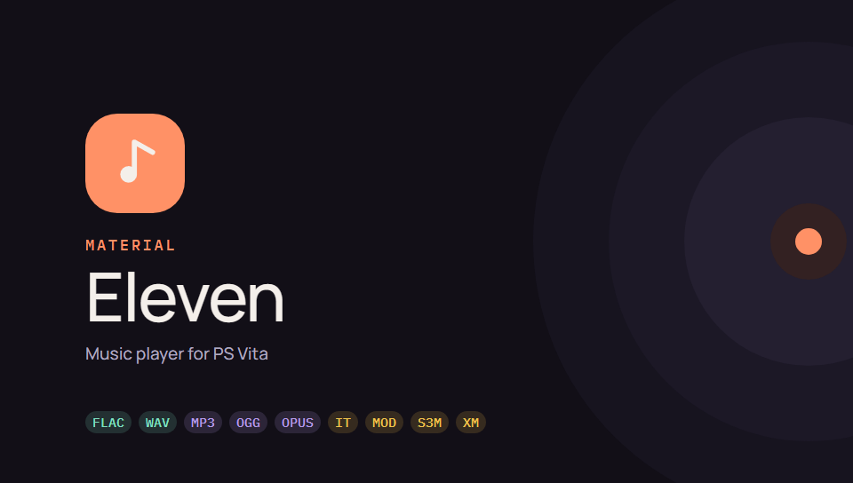
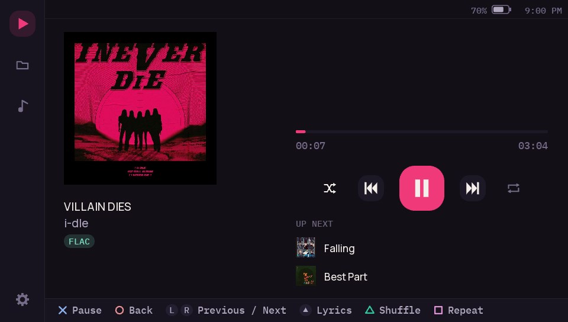
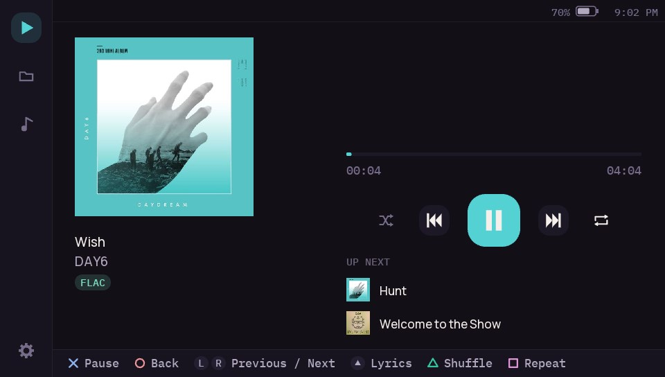
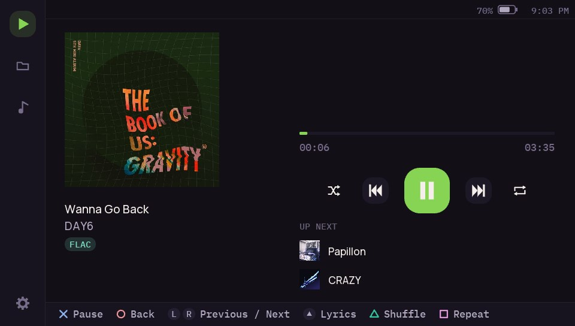
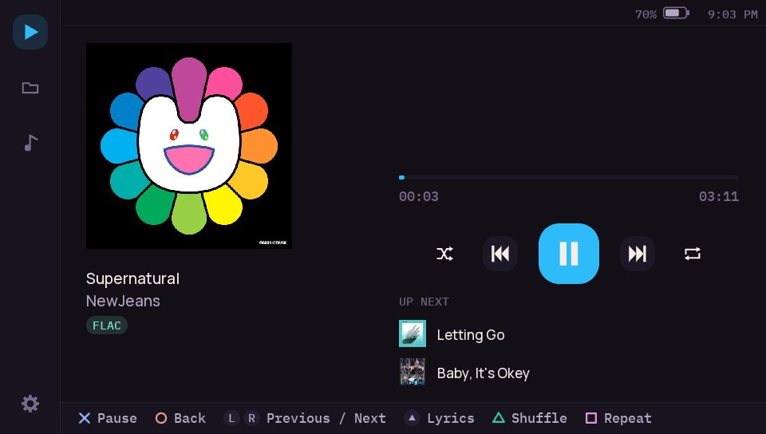
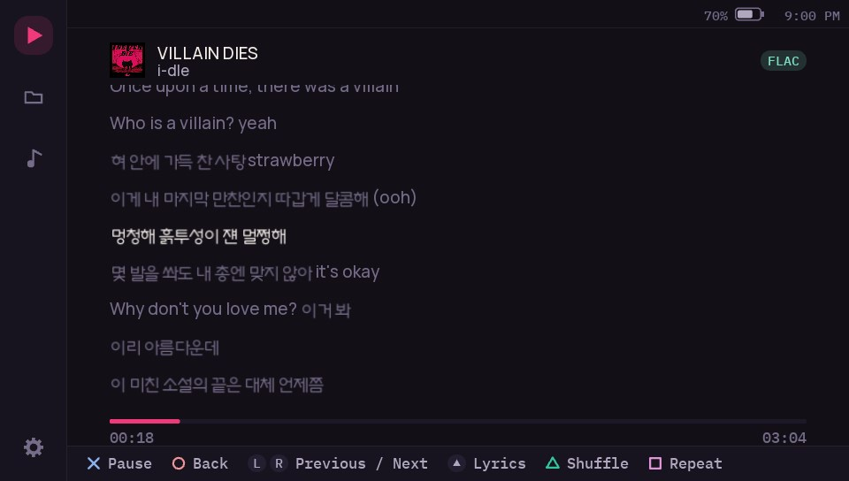
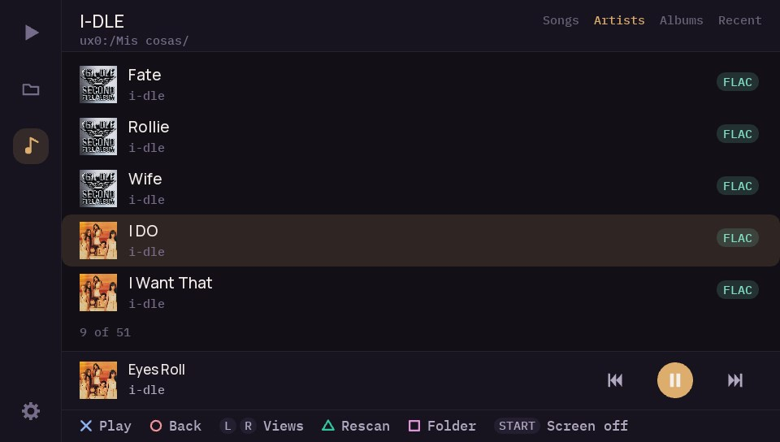
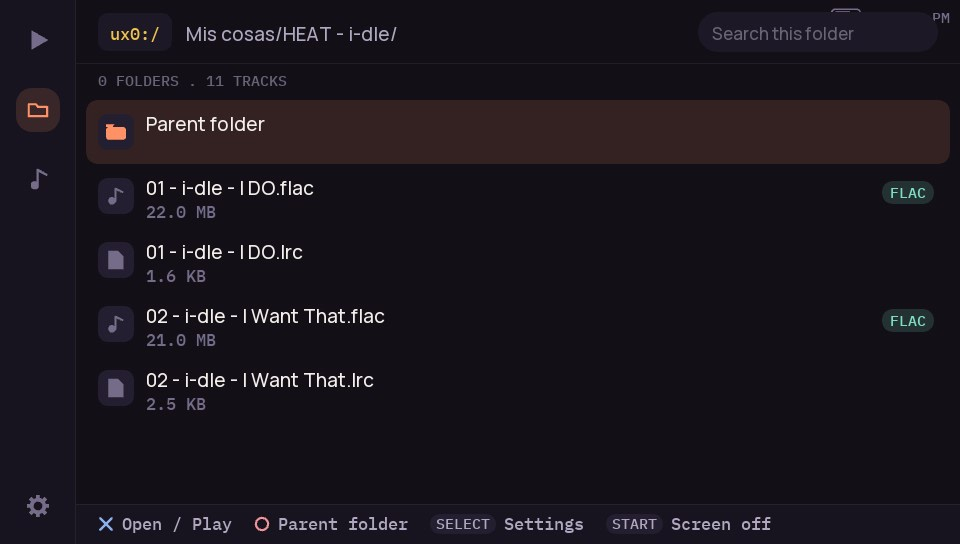
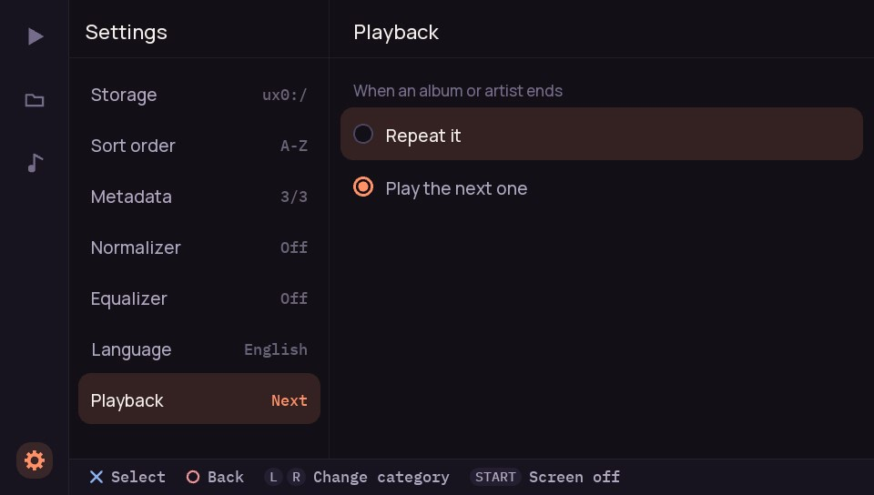

# Material-Eleven

A homebrew music player for PlayStation Vita, with a Material You interface, a music library and support for many more audio formats than the official PS Vita music application.

Material-Eleven is a modified fork of [ElevenMPV](https://github.com/joel16/ElevenMPV) by Joel16, and it includes audio improvements ported from [ElevenMPV-A](https://github.com/GrapheneCt/ElevenMPV-A) by GrapheneCt.

https://github.com/user-attachments/assets/baf1d881-d672-44b8-8a34-a90e73f90dde

# Screenshots:

| | |
|---|---|
|  |  |
|  |  |
|  |  |
|  |  |

Screenshots of earlier versions are in [docs/screenshots](docs/screenshots).

# Currently supported formats: (16 bit signed samples)
- FLAC
- IT
- MOD
- MP3
- OGG
- OPUS
- S3M
- WAV (A-law and u-law, Microsoft ADPCM, IMA ADPCM)
- XM

# Features:
**Interface**
- A Material You style interface with a navigation rail for Now Playing, Folders, Library and Settings.
- An accent colour taken from the cover art of the track that is playing.
- Vector-drawn controls and new font rendering (Manrope, IBM Plex Mono).
- A mini player at the bottom of the Folders and Library screens.
- Available in English and Spanish. On first launch it follows the console language.
- Touch support for the navigation rail, the transport controls, the mini player and the seek bar.

**Library**
- Scans a folder of your choice and indexes the music in it.
- Four views: Songs, Artists, Albums and Recent (most recently added first).
- Cover art thumbnails, cached on the memory card.
- Playing from a view makes that view the playback queue, even when an album is spread across several folders.

**Folder browser**
- Browse ux0:/, ur0:/ and uma0:/ and play any of the supported formats.
- Search the current folder by name.
- Sort by name or by size.

**Playback**
- A playback queue with an "Up next" list, and independent shuffle and repeat.
- Seeking with the touch screen.
- Displays ID3v1 and ID3v2 metadata for MP3 files. Other tags are displayed for OGG, FLAC, OPUS and XM.
- Turn off the display and keep listening in the background.
- A full-screen lyrics view on Now Playing (see Lyrics below).

**Lyrics**
- Press Up on the D-pad on Now Playing to open the lyrics view, and again to close it.
- Lyrics come from two places: a `.lrc` file next to the track with the same name (`Song.flac` and
  `Song.lrc`), and the lyrics embedded in the track (`LYRICS` or `UNSYNCEDLYRICS` in FLAC, OGG and
  Opus, `USLT` in MP3).
- When both exist, the one with timestamps wins; if both have them, or neither does, the `.lrc` wins.
- Synced lyrics follow the song line by line, with the current line highlighted. Drag them to look
  around; a few seconds after you let go, the view returns to the line being sung. `[offset:]` in
  a `.lrc` is honoured; per-word timestamps are ignored and the line's time is used.
- Lyrics without timestamps are shown as text you can scroll, with section headers such as
  `[Verse]` dimmed.
- Files over 64 KB are ignored.
- **Save `.lrc` files as UTF-8.** UTF-16 with a byte order mark and Windows-1252 are also read, but
  a file in any other encoding (Shift-JIS, GBK, Big5, EUC-KR...) will show the wrong characters.

**Audio** (ported from ElevenMPV-A)
- The volume follows the system volume control.
- Hardware EQ presets (Heavy, Pop, Jazz, Unique), with an optional volume limiter.
- An optional normalizer.

# Controls:
The enter and cancel buttons (cross/circle) follow your console's settings.

**Folders:**

- Enter button: open folder / play supported audio file.
- Cancel button: clear the search filter, or go up to the parent folder.
- DPAD Up/Down: navigate files.
- DPAD Left/Right: top/bottom of the list.
- Select: open Settings.
- Start: exit the app.
- Touch the search box to filter the current folder. Hold L + R + Start to cancel the search.

**Library:**

- L/R triggers: switch between Songs, Artists, Albums and Recent.
- Enter button: open an artist or album / play a track.
- Cancel button: leave the artist or album.
- DPAD Up/Down: navigate the list.
- DPAD Left/Right: top/bottom of the list.
- Triangle: rescan the library.
- Square: choose the library folder.
- Select: open Settings.
- Start: exit the app.

**Now Playing: (you can also use the touch controls)**

- Enter button: play/pause.
- Cancel button: return to Folders.
- L trigger: previous track in the queue.
- R trigger: next track in the queue.
- DPAD Up: open or close the lyrics view.
- Triangle: toggle shuffle.
- Square: toggle repeat.
- Start: turn off the display and keep playing audio in the background.
- Touch: touch anywhere on the progress bar to seek to that location. In the lyrics view, drag the
  lyrics to scroll them.

**Settings:**

- L/R triggers: switch category (Storage, Sort order, Metadata, Normalizer, Equalizer, Language).
- DPAD Up/Down: navigate the options.
- Enter button: select an option.
- Cancel button: return to Folders.

# Installation:
Download `Material-Eleven-X.Y.Z.vpk` from the [Releases](https://github.com/Perroabuelo/Material-Eleven/releases) page and install it with VitaShell. Installing over a previous version keeps your library and your settings.

# License:
Material-Eleven is distributed under the GNU General Public License, version 3 or (at your option) any later version. See [LICENSE](LICENSE).

It is based on ElevenMPV, whose original code is © 2019 Joel16 under the [Apache License 2.0](LICENSES/Apache-2.0.txt), and it includes code derived from ElevenMPV-A, © 2020-2022 GrapheneCt and contributors, under the GPL-3.0-or-later. [NOTICE](NOTICE) records which part comes from where, and lists every third-party component and its license. The license texts are in [LICENSES](LICENSES), and the .vpk carries them, together with LICENSE and NOTICE, in its `licenses/` directory.

# Credits:
- Joel16, for ElevenMPV, the player this project is built on.
- GrapheneCt and the ElevenMPV-A contributors, for the audio pipeline improvements ported from ElevenMPV-A.
- MPG123 contributors.
- dr_libs by mackron.
- libFLAC, libvorbis, libogg, libopus and opusfile contributors (Xiph.Org).
- libxmp-lite contributors.
- vita2d by xerpi, and the FreeType, libpng, libjpeg-turbo, zlib and bzip2 projects. This software is based in part on the work of the Independent JPEG Group.
- LineageOS's Eleven Music Player contributors for design elements.
- Manrope and IBM Plex Mono authors, fonts under the SIL Open Font License 1.1.
